<h1>OAuth</h1>

Single sign-on (SSO) is a centralized session and user authentication service in which one set of login credentials can 
be used to access multiple applications. Its beauty is in its simplicity; the service authenticates you on one 
designated platform, enabling you to then use a variety of services without having to log in and out each time.

In the most common arrangement, the identity provider and service provider establish a trust relationship by exchanging 
digital certificates and metadata, and communicate with one another via open standards such as 
Security Assertion Markup Language (SAML), OAuth, or OpenID.

There are three key terms you need to know in SSO lingo:
* Service provider: In an SSO context, this is an application or website that a user might want to log into—anything 
from an email client to a bank website to a network share. Most platforms like these would include their own 
functionality for authenticating users if they were standing alone, but that's not the case with SSO.
* Identity provider: With SSO, responsibility for authenticating users is fielded out to an identity provider—generally, 
the SSO platform itself. When the user attempts to access the service provider, the service provider will consult with 
the identity provider to ensure that the user has proven that they are who they claim to be. The service provider can 
put parameters around how authentication works: for instance, it can require that the identity provider use two-factor 
authentication (2FA) or biometrics. The identity provider will either ask the user to log in, or, if they've logged in 
recently, may simply let the service provider know that without troubling the user further.
* Tokens: These are small collections of structured information that are digitally signed to ensure mutual trust, and 
they're the medium by which the service and identity providers communicate. It's through these tokens that the identity 
provider will tell the service provider that the user has authenticated—but, crucially, the tokens don't include 
authentication data like the user's password or biometric data. As a result, even if the tokens are intercepted by an 
attacker or the service provider's systems are breached, the user's password and identity remain secure. The user can 
also use the same login credentials for any service providers using that identity provider.

OAuth is an open-standard authorization protocol or framework that describes how unrelated servers and services can 
safely allow authenticated access to their assets without actually sharing the initial, related, single logon credential. 
In authentication parlance, this is known as secure, third-party, user-agent, delegated authorization.

<h2>Roles</h2>
* **The user (Resource Owner)** - the person with the account. _For example, I’m the Resource Owner of my Facebook profile._
* **The device (User Agent)** - the device being used by the user
* **The application (The OAuth Client)** - the device is running an application or accessing the 
application. _Ex. a client application could be a game requesting access to a users Facebook account._
* **The API (Resource Server)** - what the application is making requests to. Can be one or multiple
servers. _For instance, Facebook is a resource server (or has a resource server)._
* **The authorization server** - manage access to the server that it's protecting. The only one who
will see the user's password. Exchanges a cookie/token for the password. In smaller applications
the authorization server could be combined with the resource server. The authorization server verifies the identity of 
the user then issues access tokens to the application.

<h2>Application types</h2>
* Confidential - has the ability to be deployed with a client secret, the secret won't be visible
to anyone using the app. So things that end up on a device that is not touchable by the client.
Identity has been confirmed.
* Credentialed - a client which has credentials, but its identity isn't established by the server.
Dynamic registration is used to get a client secret. So an initial query is being sent to register
a client, but the initial query could be sent by anyone. That initial query would contain no
identification information. Can conclude that all the following requests are made by the same 
client instance, though. Can approach the client as a half-and-half. Know that refresh tokens
are all being requested by the same client, but give out the lifetime of the token as if to
a public client.
* Public - code that gets run on a client's device. Secrets will be accessible by the user. For
example SPA or mobile apps. Identity has not been confirmed.

The distinction matters, because the auth server might behave differently depending on who is
making the request. You might skip a step if you can guarantee that the application is not being
mimicked. So with a confidential app, you could be sure of it, as the secret key should never be
visible to the client, thus could not be re-used for faking requests. Skipping the consent screen,
including refresh tokens, limiting the token lifetime, these are some things that the server
might choose to do differently based on the application type.

User consent form - user consent represents a user's explicit permission to allow an application to access 
resources protected by scopes. Consent grants are different from tokens because a consent can outlast a token, 
and there can be multiple tokens with varying sets of scopes derived from a single consent. When an application 
needs to get a new access token from an authorization server, the user isn't prompted for consent if they have 
already consented to the specified scopes. Consent grants remain valid until the user or admin manually revokes 
them, or until the user, application, authorization server, or scope is deactivated or deleted.

Without the user consent form, the flow would have to utilize the password grant, which means handing your password
over to a third party app, which raises questions of trust. Image going to a random website and being asked for your
Facebook password. Also, there would be no limiting the scope of what the
app can use. The password grant also eliminates knowing if the user is at the computer. The password might just be
saved in the app. The consent form happens on the authorization server, where the user would be asked for the password,
thus verifying that the user is at the computer. If everything is happening through the authorization server, then it's
pretty easy to add MFA as well. First party apps might want to skip the consent form, as there isn't a trust issue. Still
has to do the redirects, though.

<h2>How data moves around</h2>

Back channel - a direct communication between the client and the token endpoint over HTTPS. We know who we're talking
to because of the certificates. Data is encrypted in transit. Can trust the response because we know where it came from.
This is akin to hand-delivering a package face to face. This is the secure method and we should prefer this whenever
possible. Back channel IS NOT a backend. A JS app can absolutely use the back channel. What this means is JS making
the request from JS code, like an AJX or a fetch request. Making the request from JS has the same properties as making
a request from a backend server. That's because you get certificate verification and an encrypted connection. This is
very different from sending data in the front channel, which is just using the address bar to move data where there are
a lot more failure points, and chances for data to be intercepted.

Front channel - indirect communication between the client and the authorization endpoint via the user's agent 
(using the browser's address bar). Akin to handing a package over a delivery service. You hand the package over and
the service delivers it. There's no direct link between the sender and the receiver. You can never be sure that the
delivery service doesn't do something you don't expect. Neither the sender nor receiver can be sure that what's being
sent/received is untampered. With the back channel, we have no way of asking for a consent from the user. This is why
we use the front channel, because we can insert the user into the flow. 
The flow would look something like this:
* First the application server would send a request to the authorization server, saying what it wants to do. This
includes the application's identifier, scopes etc. It's usually safe to send this in the front channel, as nothing
in this request is particularly sensitive.
* The user logs in and authorizes the request. The authorization server is ready to send an access token back to the
application and redirect the user back to the application. The access token cannot be sent via the redirect, because
that would be like sending an access token via the mail. The authorization server would have no guarantees that it was 
actually delivered back to the application, and the application wouldn't have any guarantees that the access token is
really from the authorization server. This approach is described in the core OAuth spec, but it's not recommended because
of the lack of security. This is called the implicit flow, and it uses the front channel for all communication. It's
included in the spec, because it used to be that browsers had no other option, as CORS requests used to be not possible. 
The solution is to deliver the access token in the back channel instead. 

<h2>Application identity</h2>

Each application has its own identifier called a client ID, which it uses to identify itself throughout the OAuth flow.
The redirect link to the authorization server is sent with a ClientID in it, among all the other important parameters.
The authorization server send an authorization code back to the server. This is basically like a short-lived coupon that
can be used to redeem an access token. Since this is done through the front channel, then the server cannot be sure that
whoever is redeeming it is, indeed, the client server. The client secret is used to verify the identity of the client
server. So in order for the client server to successfully redeem the authorization code, it needs to provide that and
a correct client secret. However, SPAs and mobile apps cannot be deployed with a client secret. They use PKCE.

The Redirect URI is where the user will be sent to from the authorization server after they log in. The authorization
code will be sent there. It might be a URL or a custom URL scheme. The HTTPS URLs are considered to be globally unique,
as you own that URL. Custom URL schemes aren't usable as application identity, as there is no guarantee of uniqueness
and ownership. So an application's HTTPS URL is part of an application's identity. With SPAs and mobile apps we can 
use this for their identity. You have to consider security policies based on the context.

<h2>Application flow</h2>

For public apps like Facebook, registering your app is pretty straightforward. Otherwise, it's not quite as self-serve.
When you register an app, you get a client_id (public information), and you may or may not also get a client_secret
(secret). You'll also have to enter a bunch of different information, but at a minimum you'll be able to enter a 
name and a redirect URI or two. A wildcard URI should not be allowed, as that's a potential attack vector.

1. The user turns to the app
2. The app generates a random secret. This is unique for each flow execution. This is called the PKCE code verifier.
It holds the random secret in memory. Also, a hash is generated from it called a PKCE code challenge.
   
   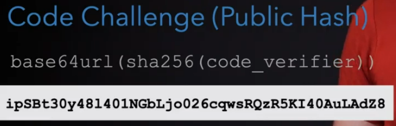
3. The app redirects the user to the authorization server and adds the hash to the call. So this is happening in the
front channel because it's through the browser. A call to the auth endpoint follows, to which you add a bunch of query
string parameters: 
   * response_type=code, this tells the server that you're doing the authorization code flow.
   * client_id=CLIENT_ID, this tells the server which app is making the call.
   * redirect_uri=REDIRECT_URI, this has to match one of the URIs that you have registered for your app.
   * scope=SCOPE_VALUE, this is for the scopes that you are trying to access.
   * state=XXXX, this was originally used for CSRF protection, but PKCE fixes the same issue. So this could be 
   used to save application specific data. Although, this is only safe to be used this way if you are sure that
   the OAuth server supports PKCE. If not, then this has to be a random value.
   * code_challenge=XXXXXXXXXXXXXX, this is the hash that was generated initially.
   * code_challenge_method=S256, this is the hash method that was used to produce the hash.
     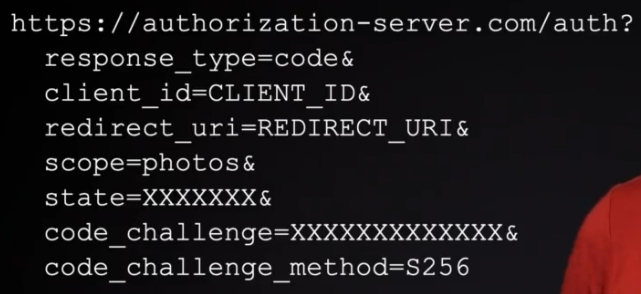

   The user does all the auth that is necessary on the authorization server.

4. The authentication server returns a temporary code for the app to use. The browser receives the code and the code
is forwarded to the backend. There is also the possibility that some error will have occurred.
   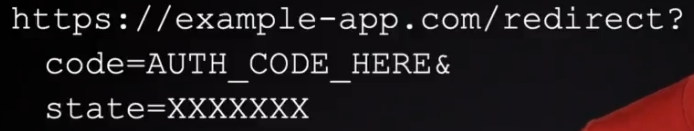
   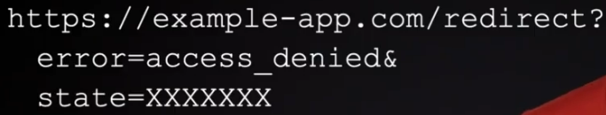
5. The server should validate that the state value matched, if no PKCE is available. The server forwards the code,
the plaintext PKCE code secret that was initially created, and asks for a token.
   * grant_type=authorization_code, tells the server that you're doing an authorization code grant.
   * code=AUTH_CODE_HERE, the authorization code that was provided by the authorization server back to the app.
   * redirect_uri=REDIRECT_URI, the URI that was used in the request.
   * code_verifier=VERIFIER_STRING, the plaintext code that was generated at the start.
   * client_id=CLIENT_ID, the app identifier for the authorization server.
   * client_secret=CLIENT_SECRET, the secret of the app.
     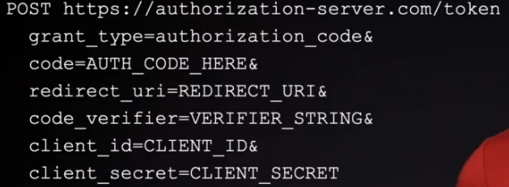
6. The server verifies the secret and then returns an access token. Possibly with a refresh token.
   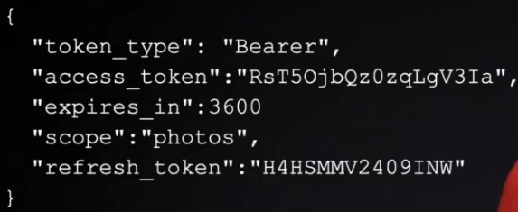
   If the current access token expires, then a refresh token could be used to get a new access token without doing 
the entire flow again. This then returns a new access token, and possibly a new refresh token. There are a whole bunch
of reasons why a refresh token might fail, though, so it's entirely possible for this call to fail. So when it fails, 
then a full new authorization flow should be attempted.
   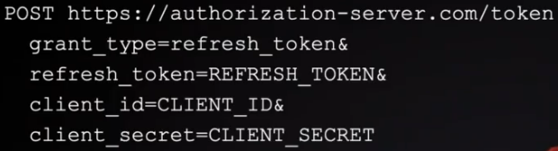

PKCE was initially developed for mobile apps. The guidance is now recommended for all kinds of applications. With
server side apps there is still a subtle attack you can pull off called an authorization code injection attack, where 
you can swap authorization codes and end up logged into as someone else. So PKCE helps against this. You may find 
servers that do not support PKCE for confidential clients. In that case you should recommend that they add PKCE support.
You can still add PKCE parameters, even if they aren't support today, as the server simply ignores parameters it doesn't
care about, but when PKCE support becomes available, then it'll become so automatically in the future.

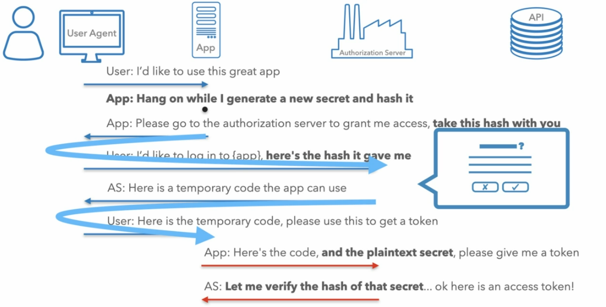

<h2>Native apps flow</h2>

Native apps lose a lot of the built-in security that exist in browsers. For example, it checks the DNS, validates HTTPS.
The redirect URL is where the differences come in. The native app opens up an in-app browser to the auth server, and then
it returns a redirect URL. 

There are two ways how a redirect URL can happen within a mobile app. 

It used to be common
that applications would be able to just define a custom URL scheme and any time anything in the phone launched a URL 
matching that scheme, that app would launch instead. The issue is that there's no registry of these, so any app can
claim any URL scheme. If someone figures out your app scheme, then they can just create their own app with the same
scheme, and they'd race for the launch. Opens up a chance to steal auth codes in the redirect.

The more modern way for redirects to be claimed is by claiming URL patterns. Also known as deep linking. This is where
your mobile app can claim a URL pattern, including a full domain name or even path. And then again, once that's 
registered, any app that launches your URL will launch your app instead. This is how you get things like when you
click on a link to Amazon, you get taken to the Amazon app with that product loaded or linking to an Instagram photo
where you get dropped right into the Instagram app instead of the website. What makes this more secure is that the
app developer has to actually prove that they control that domain name. There are, however, still ways it can fail
so we can't trust it as much as the browser. And that's really why PKCE is so important.

One of the most important parts about the OAuth flow in a mobile environment is how the mobile app launches 
the browser to the OAuth server to start the flow. 

It used to be that the most secure way to do it was to
launch the native app (Safari, Chrome). You launch the browser, your app goes into the background, they'd log in,
switch back. It's more fragile since the user leaves the context of the app. Another thing that was previously used
was embedding a webview into the app. A couple of issues with that is that the user could not see the address bar,
can't verify where they are, might be on an attacker site. Also, cookies aren't shared with the system. So if you're
logged in the browser, then you wouldn't be in the webview. Additionally, the app has full control over the webview,
so they could read the password if they wanted to.

Things have got a lot better now. We now have APIs which are able to launch a browser in a secure way within the 
application, which means the user never actually leaves the app. The user is inside the app, they click a button, 
the web view pops up in front of the application, they can log in there, and then it goes away, and they're still
within the application. The nice thing about this is that the user never leaves the app. Also, the app doesn't
have access to the browser. Also, it shares cookies with the system, thus saving the user from having to log in 
again.

<h2>Authorization code flow for native apps</h2>

The flow is pretty much the same as for the regular flow, but you don't move around a client secret key.

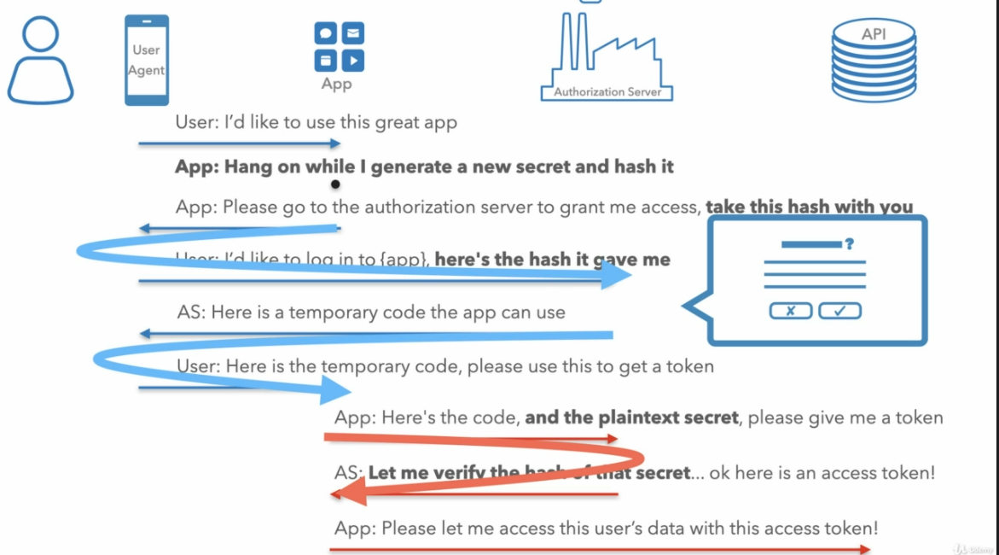

Depending on the server configuration, the server might return a refresh token or the app might need to
explicitly ask for it. Since there is no client secret, then anyone that possesses the refresh token would 
be able to get a new token. So you need to take proper care to protect the refresh token. Luckily enough, most
of this is already taken care of by the native app platforms, isolating apps from each other and things like that.
There's also a particularly useful API on mobile to better keep your refresh token safe. The secure storage API
is one which the app's code can't access anymore with biometric validation after storing into it. 
When trying to log in again with the  refresh token, the app prompts the user for biometrics to be able to 
access it, making the refresh token available to the app. It then makes that request using the refresh token, and it
gets a new access token back, and the user is logged in. The user didn't have to see a web browser, just looks like
a seamless  FaceID or thumbprint authentication. Your app wouldn't even be able to accidentally extract the refresh
token.

<h2>OAuth for SPAs</h2>

SPAs have several limitations. 
* There is no way of shipping credentials in the app, so they are considered public clients in OAuth terms. This can be
mitigated with PKCE, though.
* Browsers are vulnerable to a whole bunch of attacks. Ex. XSS. XSS can come from your app or from third party scripts that
you have included in your app. Users might also have custom plugins that can cause
security issues. Browsers also have no secure storage. If your code can read the storage, then there's a chance an
attacker's JS can as well.

OAuth servers can have significantly different policies for single-page apps compared to other kinds of apps. 
For example, refresh tokens might be disabled completely or they might be single use only. Token lifetimes might be
shorter to reduce the risk from leaking.

Similar to a native app, you won't have a client secret. The generated secret is usually stored in LocalStorage or
SessionStorage.

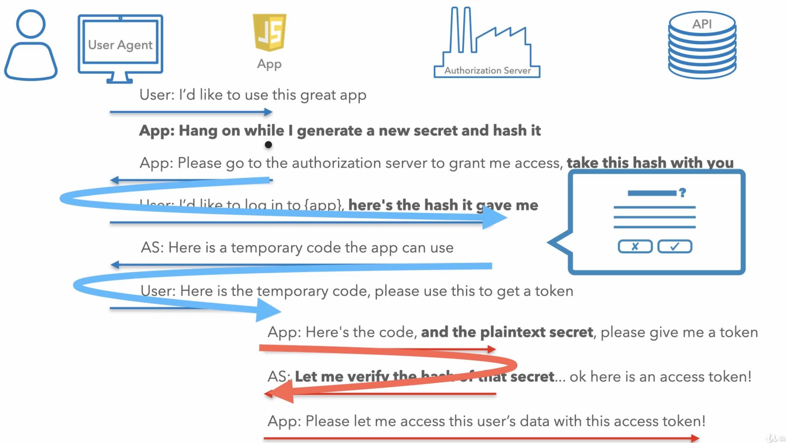

There are a couple of ways to secure a token in a browser
* Keeping it in memory will make it a lot harder for an attack to get to it. This means that it won't persist through
refreshes and tabs, though.
* Storing it in a Service Worker. Service Workers are completely isolated from the main browser window, so XSS
attackers won't actually have access to it. The downside is that it's more complicated and doesn't work in IE11.
You'd have to use a service worker as a little isolated OAUth client, meaning that your JS can't make API calls itself
anymore and needs to instead tell the service worker to make the API call, and then it'll just handle the response.
An XSS attacker could still tell your service worker to go make those requests.
* A WebCrypto API could also be used, which isn't supported in IE11. It generates a private key, while preventing that
private key from being extracted. You can use the key to encrypt things that you might want to store. Better than
storing in plaintext into LocalStorage, but an attacker could still use that key to decrypt the storage. But it
would be a more targeted attack than a LocalStorage look around.

So the only way to keep tokens safe from JS based attacks is to not give JS access to tokens at all. This can be 
achieved by using a HTTPOnly session cookie to the browser. Although, this only works if you have a backend.

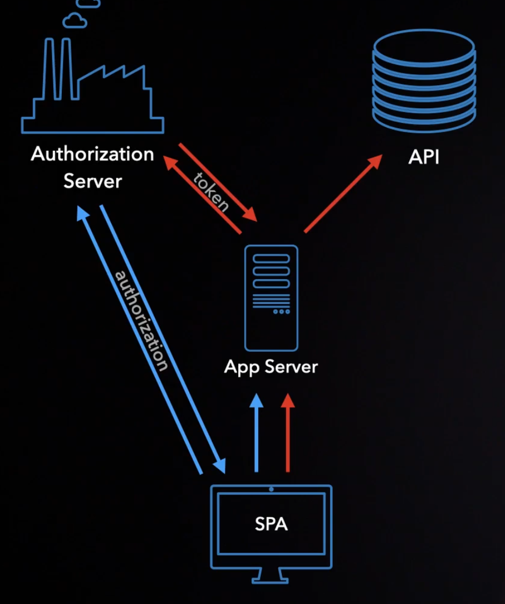

<h2>IoT flow</h2>

There's no real comfortable way to provide input. That is, there is no way to write in your password easily.
The logic that is used for IoT devices is showing a screen to which you should go to log in on another device.
It consists of two pieces - a URL and a code to enter at that URL. It all happens with the device talking to
the OAuth server first. Gets a set of instructions, shows the code to the user. Take your phone, go to the URL,
enter the code, log in how you would normally, and then put your phone away. Meanwhile, the device is polling
every couple of seconds waiting for you to be done logging in. Eventually gets its token. Every OAuth server
does not support this flow, so need to double-check it's supported. Could also set up a proxy server in the
middle to coordinate the device flow where it delegates out to the real OAuth server.

So the flow goes like this:
1. The user wants to log in
2. The device tells the OAuth server that someone's trying to log in. I don't know who they are, but here's
my identifier (clientId).
   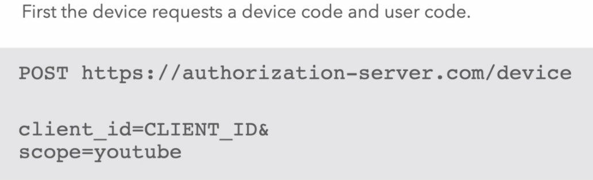
3. The server provides the device with some instructions. A temporary code to show to the user, and a longer
temporary code that the device has to hold onto. Also, a URL that tells the user to go log in at, and some
instructions to the device about how long to poll and how long this request is valid. The `device_code` is what
the device will use for polling. The `user_code` will be shown to the user. `verification_uri` is the URL to
tell the user to go to. `expires_in` is how long it's valid. `interval` is how long it should wait when polling.
   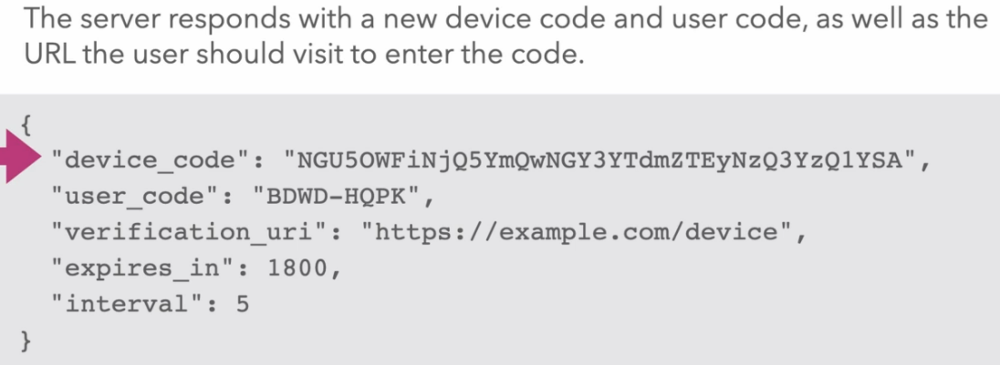
4. The device shows this information to the user - the URL and the short code.
5. The user gets redirected to the OAuth server. User enters the short code and then proceeds the same way
they always would.
6. OAuth server says that it's done. Can put their phone away.
7. During this time the device has been polling with its long code. 
   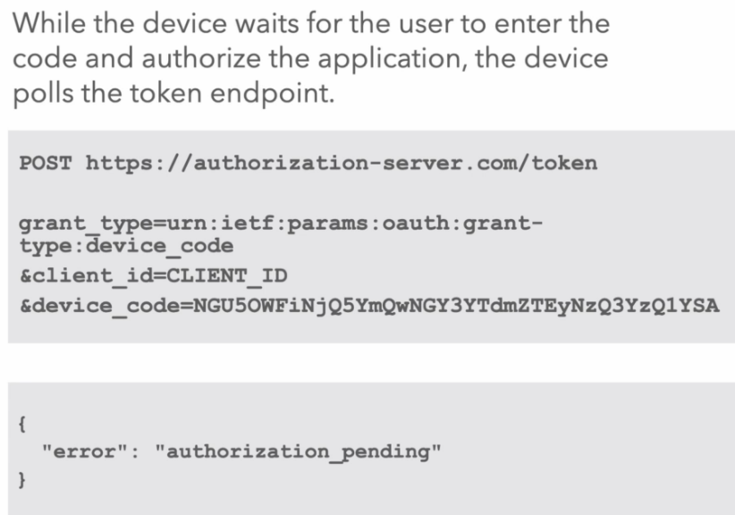
8. Eventually it gets an access token for it after the user has finished logging in. The refresh token is pretty
useful in this flow as the entire flow is kind of long and bothersome.
   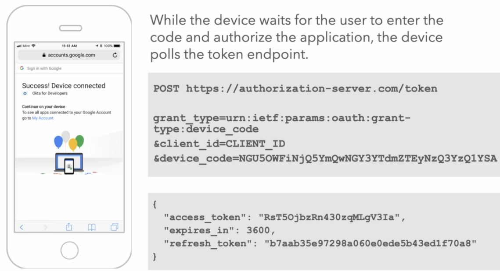

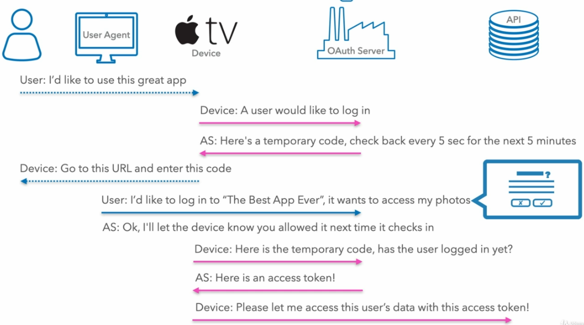

<h2>Client credentials flow</h2>

One of the simplest flows, as there is no user involved. No user, no redirects. The application takes its own
credentials and exchanges them for an access token. The intent of the client credentials grant is to give the
application a way to get an access token without the user's interaction. It's just trying to access its own 
resources. Ex. making backend requests to microservices, getting statistics about how many users are using
an app.

There might be a couple of reasons why you'd want to do this.
* Your backend probably already has a way to validate tokens, so you can re-use token validation logic.
* The API doesn't need to have knowledge of client credentials at all. Don't need access to the DB where the client
credentials live. Sometimes it's also possible to validate access tokens without any network traffic, making this much
more scalable for large scale deployments.

In order to use it, first you'll have to register an application at the OAuth server in order to get credentials.
The exact process depends on the server, but usually there's a machine-to-machine or service account option. If none
of those exist, just choose an option that gets you a client secret, like choosing a web app or a server side app.
Once you register, you should get a client ID and a client secret and that's all that is needed. You'll then be making
a POST request for the access token. If you want a down-scoped token, then you also include the scope. The client
credentials providing depends on the server. You'll either provide it in the body or in an HTTP header as Basic Auth.
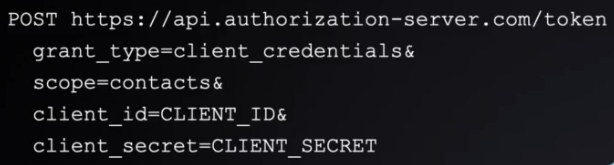
The response looks the same as every other access token response. You probably won't get a refresh token as there's
no real benefit to it. The access token might have an expiration date. Up to the server to decide how long
these access tokens last. If it expires, you don't have a refresh token, but that's fine because you just make the
same request again and get back a new access token.
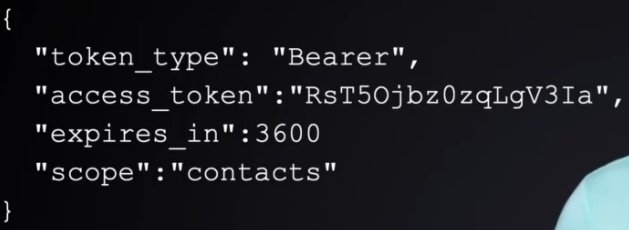

<h2>OpenID Connect</h2>

OpenID Connect adds an ID token into the flow. ID Tokens are always JWTs. Access tokens can also be a JWT. Access tokens
don't have a defined format in the spec, they can be anything. Open ID tokens are defined as JWT in the standard.

A JWT consists of a header, payload, and signature. These three parts are base64 encoded. The first two parts are
base64-encoded JSON. If you were to take out these two parts, run them through a base64 decoder, you will see
that they are just plain JSON. The signature is just the base64 encoded signature.
* The header talks about the ID token. That's going to include things like which
  of the algorithm was used, and the identifier of the key that signed the token.
* The payload contains the data that you care about
* The signature is how you validate the token
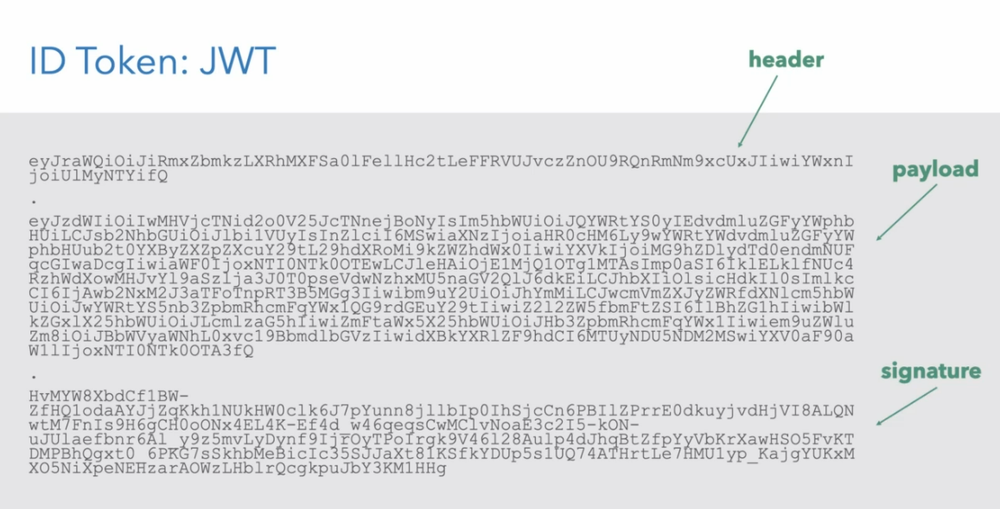

An example of a decoded ID token
* The header
  * kid - identifier of the key that signed the token
  * alg - what algorithm was used
* Payload contains a bunch of different things. A user identifier (sub - subject), possibly their profile information,
such as their name or their email. A user identifier has no defined format in the spec, so it's up to the server to decide
what it will look like. There are also some other properties, typically those will be
  * iss - issuer, which is the identifier of the server that issued the token
  * aud - audience, who this token is for. Ex. the client ID of your application
  * iat - issued at, timestamp when the token was issued
  * exp - which is when it will expire, meant to not be considered valid after this point
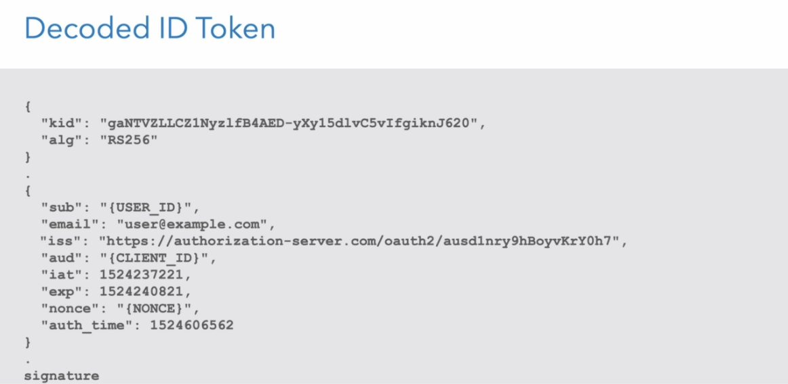

<h3>Access tokens vs ID Tokens</h3>

On a high level, these are completely different things.

An access token is what the application gets in order to be able to make API requests to an API. An API should not
understand what the access token means. It's in the design principle of OAuth that access tokens are usually opaque to
applications. That means that the apps cannot see through them, they can't see into them. An app should ideally treat
the access token as an opaque string.

ID tokens are meant to be read by the application. Validate the signature, validate the claims, and then learn about
the user.

The two actually have different audiences. If you look into it, then you can see different aud values. The audience
of the ID token is the application. Whereas the audience of the access token is the API, or the resource server.
We could decode it in our example, since a JWT was used. But it's important to remember that they don't have to be
JWTs. It might be something else entirely. The application should make no assumptions about what format the access
token is in, but OpenID tokens are always JWTs and applications have to know how to validate them in order to use them.
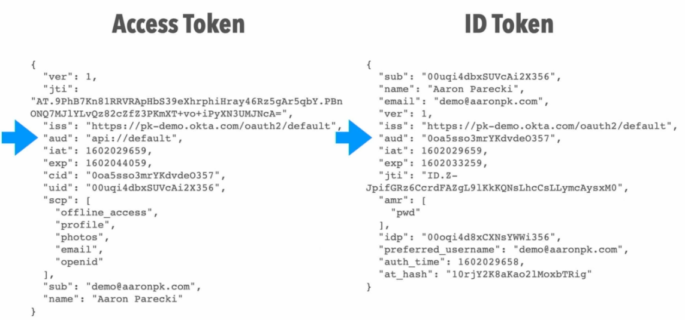

Applications often want to get both an access token and an ID token. If an application is already getting an access token
using the authorization code flow, then by far the easiest way to get an ID token is to add the scope "openid" to the
request, and you'll get back an ID token and an access token. A nice thing about this is since you obtained the ID
token over the back channel, then you already know that it's valid and don't need to check expiration or anything. 
You can basically just extract the parts in the middle that you care about and just use that data directly. Vastly
simplifies everything. Wouldn't even need a JWT library. The signature, however, is important if you get the ID token
from another untrusted source. But if you get it over a trusted connection, over the back channel, over HTTPS, then
you don't need to bother checking the signature because you know it can't be tampered with.
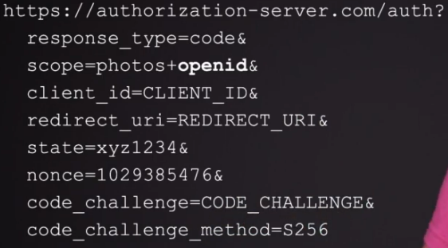
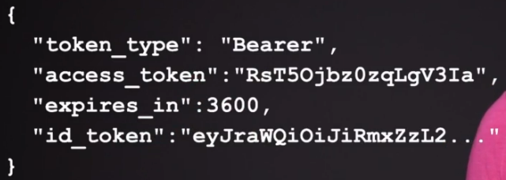

If you set `response_type` to `id_token`, then that tells the authorization server that you actually don't want an
access token at all, and that will just give you an ID token. That would then return the ID token in the redirect,
instead of the authorization code. This looks a lot like the implicit flow in OAuth, where it returns the token without
the intermediate authorization code. We can use the signature to validate where the token came from. However, when
doing this, then the auth server is in the dark on who is requesting it. If you have sensitive information in the
OpenID token, then you don't want to let applications get these over the front channel, where you can't guarantee
that things aren't snooping on it. So in that case it's much safer to get those using the back channel, using the
authorization code flow.
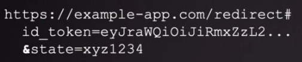

OpenID defines a bunch of different scopes that you can use in your request to get extra info. By default, if you only
include "openid" in the request, then the ID token you receive will have very little information in it aside from the
metadata about the token, like the expiration date. It'll only have the subject or the user ID of the user. If you want
more information, then you have to include additional scopes. Ex "profile".

<h3>OpenID Hybrid mode</h3>

A Hybrid flow in OpenID connect is when a combination of response types are used. In plain OAuth, you have 
`response_type=code`, which means that you just want an authorization code in the response. `response_type=id_token`
to get only an ID token in the response. OpenID Connect allows combining response types ex. 
`response_type=code+id_token`, which means that you want an ID token in the front channel and an authorization code
so you can get an access token in the back channel. There're also response types that include token, which is using the 
legacy OAuth implicit flow. This is not recommended. Do not use a response type that includes "token", if you can help
it. Combining is a little tricky, because you'll get the access token and OpenID token in different steps. Using
`response_type=code` with `scope=openid` means that you'll get both tokens in the response when you exchange an
authorization code. You don't have to worry about the validity of the JWT because you already got that token over a
trusted connection. When combining, then we get an ID token in the redirect, along with the auth code. Since it's
coming in the front channel, then it isn't trusted yet, so JWT validation has to be run.
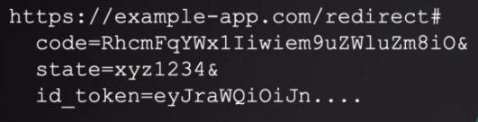
If you use `code+id_token`, then it's going to include another claim in the ID token, which you can use to validate
the authorization code. That claim is called a `c_hash`. It's going to be essentially a hash of the authorization code
itself, which you can use to verify that that code wasn't swapped out in that response.
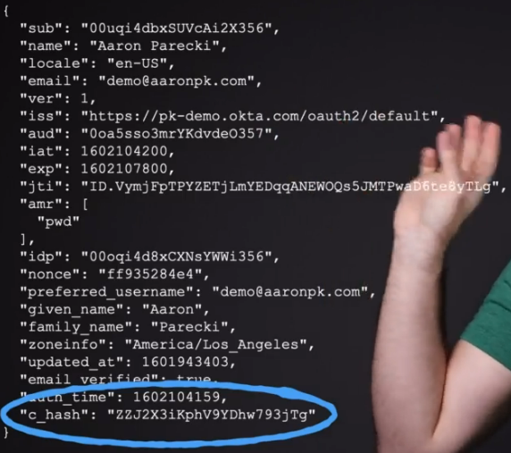
The `c_hash` can be used to guard against injection attacks, but the server can never be sure that the client is doing
that. PKCE comes in again so that the server can be sure that it's protected.

The suggestion from the OAuth group is leaning towards using PKCE even with OpenID connect, and getting the ID token,
and the access token using the authorization code flow protected by PKCE. This is the most secure option, and the least
amount of work for application developers, and it provides security at the authorization server layer rather than
relying on the security of every application developer.

<h3>How to validate and use an ID token</h3>

If you get an ID token over the front channel using the implicit or hybrid flows, then it is absolutely critical that
you validate it before you trust anything inside it.
* Validate the signature of the JWT. That way you can confirm that everything inside has not been tampered with.
To validate the signature, you need to know which key to use. Some OpenID connect servers will hard-code a key in
their documentation, or you might have found ahead of time some other method. If the server supports multiple keys,
or rotating keys, then the header of the ID token will contain an identifier of the key that signed the token. So you'll
typically use a JWT library to validate the signature since it's a bit of crypto work, and you don't want to write
cryptography code by hand. So you'll find the key that was used to sign the token. You'll also double-check the signing algorithm matches
one that you expect. Plug it into the JWT library, and it will do the work to check the signature.
* Now there's a bunch of claims inside the token that need to be validated. Otherwise, somebody might take a valid ID
token from one application or from one user and drop it into a different application, or swap it into a different
user's flow.
  * The issuer (iss) is the first one that you want to check. That makes sure that the ID token that you are looking at is
  actually coming from the server you think it's coming from.
  * The audience (aud) claim is the next one. This should match the client ID of your application. Makes sure that the ID 
  token was not issued to a different application.
  * The expires at (exp) and issued at (iat) allows you to check that the token is still valid.
  * Lastly, this is critical, check that the nonce value matches the nonce you set in the request. If you're using a 
  front channel flow, your request for an ID token has to contain a nonce value. This is one of the ways it protects
  against an injection attack. By the client generating a random value and the authorization server including it back
  in the response, that lets the client match it up and ensure that ID token was bound to the original request the
  client made.
    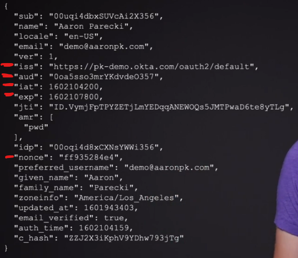

Now you've finished validating, and you can trust what is inside it.

Having said all that, if you get an ID token over the back channel using the authorization code flow, all of these
validations have already happened through other parts of the flow. So the authorization code flow is kind of like a
shortcut around all of these validation steps. It's just important to validate the ID token signature and claims if
you get the ID token over an untrusted channel like the front channel. Remember that any time your application is
able to accept an ID token from the outside world, it needs to be validated using JWT validation and all the claims.
If your ID token comes from a trusted source, the authorization server, that's when you don't need to validate it.

<h2>Access Token Types and their Tradeoffs</h2>

**Reference token** - a long, random string of characters, which doesn't mean anything. The idea is that they don't mean
anything themselves. They are a reference to data that means something. They could be implemented in a
relational database. Could also do it in a cache layer like Memcache or Redis where the random string becomes a
cache key.
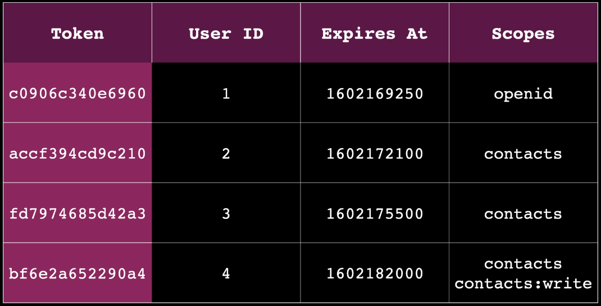

Pros:
* It's easy to create.
* Easy to understand.
* Easy to revoke.
* Point to data that isn't visible.

Cons:
* Have to be stored. Doesn't mean anything by itself. Complicates distributed APIs.
* Requires network to validate.

**Structured token** - the string contains data in some sort of format. Any way to pack data into a string would work.
A common implementation of this is JWT. There is a standard that describes if you want to use JWTs as access tokens,
then this is how you do it.

Pros:
* Don't need shared storage. Simplifies distributed APIs.
* Can be validated without network. 

Cons:
* JWT contents are visible.
* No way to revoke. Services that provide OAuth often keep a DB of their own to be able to revoke.

<h2>JWT Access Tokens</h2>

JWT spec provides a way to implement it. JWT is an encoded token that's separated into 3 parts. The parts are
separated by dots. The first two parts are base64 encoded JSON and the last is the signature. While it's signed, then
the parts aren't encrypted usually.
* The first, top part, is the header. This talks about the token. It describes things like which signing algorithm was
used, and might also identify which key was used to sign it.
* The second, middle part, is the payload and that contains the data you actually care about. It'll usually be these
short property names, followed by the value also known as the claim. These can be used to verify the payload hasn't
been tampered with. The spec defines a few claims, but the spec doesn't actually require any of them to be used,
since the spec is meant to be applicable to many kinds of use cases. There is, however, the JSON Web Token Profile for
OAuth 2.0 Access Tokens that formalizes the use of JSON Web Tokens for access tokens. The spec requires a couple of
properties:
  * iss - issuer. The identifier of the server that issued this token. Typically, the OAuth server's base URL and you
  might be able to actually fetch a discovery document based on this URL.
  * exp - expiration. UNIX timestamp at which point the access token should no longer be considered valid. 
  * iat - issued at. Timestamp at which the token was issued.
  * aud - audience. Identify the intended party that's going to be reading and validating this token. The identifier of
  the resource server.
  * sub - subject. Who the token represents. Ex. if a user is involved, then it's the user identifier. Usually, however,
  it's an opaque string, rather than a username or email address. If there is no user involved, then this should be the 
  client ID of the application instead.
  * client_id - client ID of the application that was issued this token.
  * jti - JSON Web Token ID. Unique identifier for this particular token, which a resource server can use to see if then
  token is being used more than once.
  * (optional) scope. Scope can be included if the access token was issued with a scope in the request.
  * (optional) auth_time - timestamp at which the user last authenticated at the authorization server. Ex. your API could
  use this to require that a user has to enter their password in the last hour before doing a sensitive operation, and it
  would reject the API request if this timestamp is too old.
  * (optional, from OpenID Connect) acr - authentication context class reference. Ex. if the access token was issued 
  when the user was already logged in at the server instead of confirming their password, this would be 0, and it shouldn't
  be allowed to do any operations that have monetary value like purchasing.
  * (optional, from OpenID Connect) amr - authentication methods reference. Describes how the user authenticated. Ex
  pwd, if a password was used, fpt for fingerprint, sms for SMS challenge.
    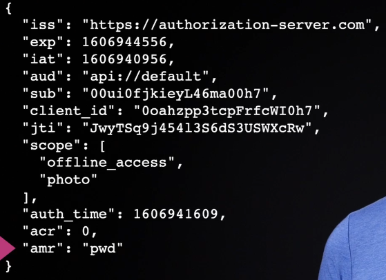
* Final part, the signature.

When validating an OAuth token, the easiest way would be to turn to the OAuth server and ask if it's valid or not.
However, you need a network connection for this, so this is the slow way. If your access tokens are a random string,
then this is really the only option. There is a new OAuth endpoint described in the specs called the introspection 
endpoint. How it can be found on the server will be specific to the server. Usually it will be either documented as
part of the server or it'll be available in the server's metadata URL. To use it a POST request would be sent with the
token being sent under the token property. The endpoint will probably require authentication of some sort as well. In
most cases, this will probably involve registering for some sort of credentials at the server. Sometimes the server will
reuse the client ID and secret of a service app, or machine to machine app for this purpose. The authentication mechanism
isn't required by the spec, so it can change from server to server. You'll get back a response with at least the property
active being true or false. This can, again, depend on the server. If your API included auth in the request to validate
the token, then the server knows which API is making this request and will also say the token is inactive if it was issued
for a different API.
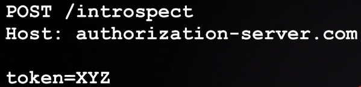

If the access token is in a structured format like JWT, then validation can be done without going over the wire. 
The easiest way of validating is using a library. However, something to keep in mind is that the JWT token is a 
cache of the data at the time that it was created. A user could be deleted, its group changed etc. So additional
validation beyond local validation might be needed. How does the validation work?
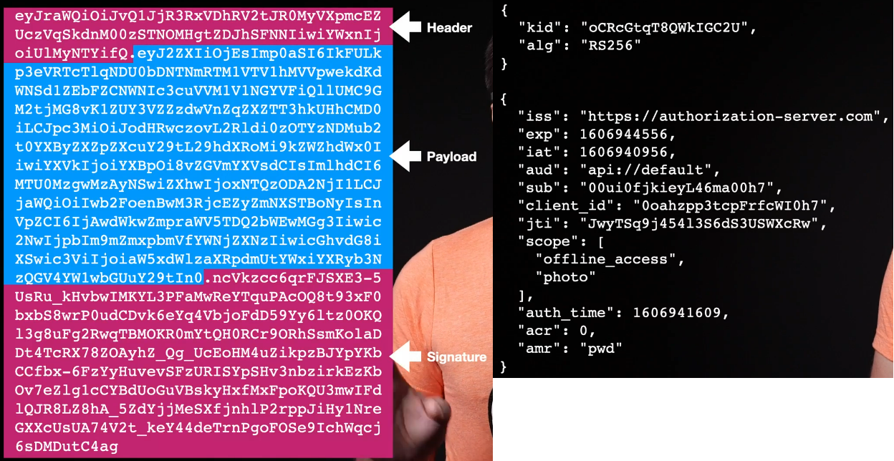
1. The header. It could contain none for the algorithm in the past, this is forbidden now. Read data out of the
header first, before verifying the signature. Since you have to treat all of this as untrusted data, then you 
should only accept signing algorithms that you know to expect from the server. An attacker might switch from an 
asymmetric algorithm to a symmetric one to trick you. In practice, you will probably end up
hard-coding a list of known signing algorithms that your server uses and only accept those values. A signing key in
the header usually ends up being a random string. If this value does not appear, then that means the server is only
using one key to sign tokens. The JWT spec recommends that a server publish its public keys and issuer identifier
on a metadata url. jwks_uri is where you can find the public keys from. You'd then use a crypto library to validate
the signature.
   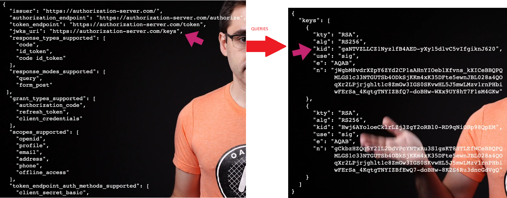
2. A valid signature does not necessarily mean that the token is valid, though. So you need to check that the iss value
corresponds to the OAuth server your API is configured to use. Check that the aud matches the identifier for your
resource server. Then validate the timestamps (exp, iat). These are the bare minimum things to validate.

The best of both worlds could be using an API Gateway. This only does local validation to keep it fast.
Next it's up to each API or even each individual method within each API to decide whether the fast validation that the
gateway did was good enough. If it requires, then it goes to the server to validate the token.
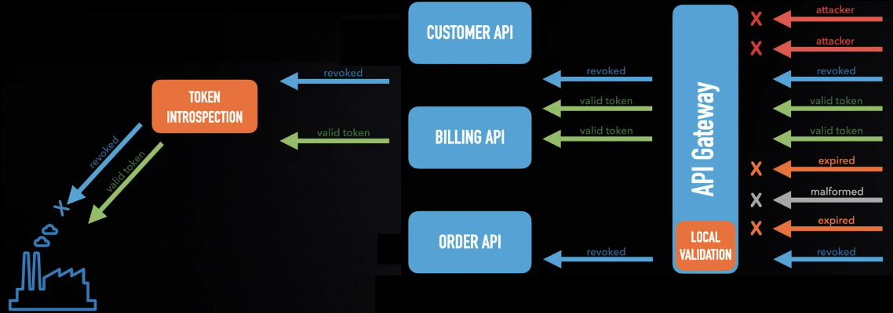

<h2>Token Lifetimes</h2>
Short lifetimes increase security, as it limits the time a stolen access token could be used. Or how long an API would
be operating with invalid data, should only the JWT validation be used instead of a DB to check for user expiration
and whatnot. However, the shorter your token, the more impact it will have on the user experience.

It's a trade-off between user experience and security. A refresh token could be used to split the difference. Although,
depending on how it works, it would still cause disruption in the form of an occasional request that is slower than 
usual or redirecting the user to the OAuth page for a sec, as the refresh token is submitted. The more disruptive
getting a new access token is, the longer an access token lifetime should be.

You can define the access token lifetime contextually. Based on user, scope, app etc. You might want to have different
access tokens in the app. Have a different one for checking out, as it's a sensitive operation. So whenever checkout is 
being done, then a re-authentication is needed.
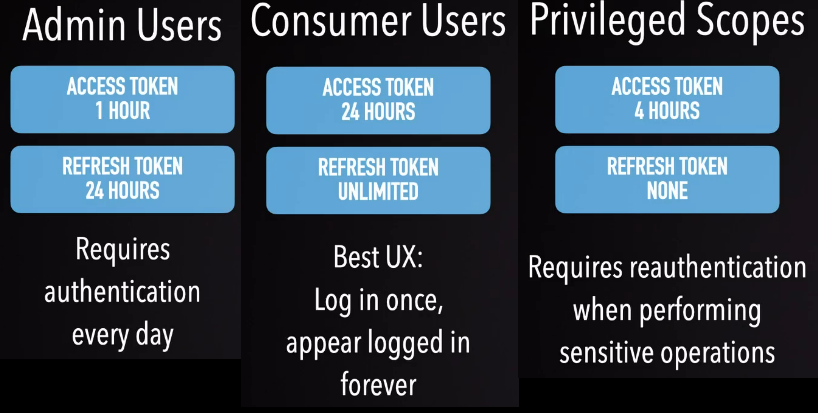

